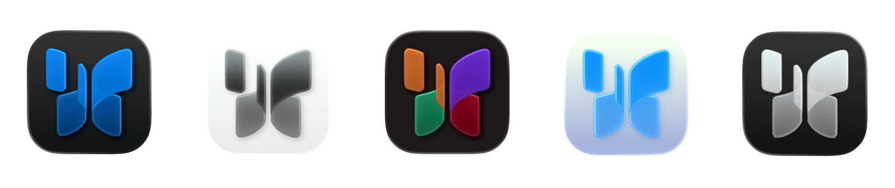

<p align="center">
  <picture>
    <source media="(prefers-color-scheme: dark)" srcset="assets/banner-dark.png">
    <source media="(prefers-color-scheme: light)" srcset="assets/banner-light.png">
    
  </picture>
</p>

<h1 align="center">Icon Composer MCP</h1>

<p align="center">
  CLI and MCP server for creating images, icons, and logos with Liquid Glass effects (iOS 26+). Not affiliated with Apple .
</p>

<p align="center">
  <a href="https://www.npmjs.com/package/icon-composer-mcp"></a>
  <a href="LICENSE"></a>
  
  
</p>

---

## Demo

<!-- TODO: Add screenshot grid or GIF showing the tool in action -->
<!-- Suggested: 3-4 rendered icons showing different styles (flat, glass, dark mode, marketing export) -->

<p align="center">
  
</p>

## Key Features

- **Create `.icon` bundles** programmatically from PNG or SVG glyphs
- **Full Liquid Glass** support: specular highlights, blur material, shadows, translucency
- **Dark mode + appearance variants** with per-appearance fill specializations
- **AI-agent ready**: 12 MCP tools + 3 workflow prompts with built-in instructions

## Installation

<details open>
<summary>&nbsp;&nbsp;&nbsp;<b>Claude Code</b></summary>

&nbsp;

```bash
claude mcp add icon-composer -- npx -y icon-composer-mcp
```

</details>

<details>
<summary>&nbsp;&nbsp;&nbsp;<b>Claude Desktop</b></summary>

&nbsp;

Add to `~/Library/Application Support/Claude/claude_desktop_config.json`:

```json
{
  "mcpServers": {
    "icon-composer": {
      "command": "npx",
      "args": ["-y", "icon-composer-mcp"]
    }
  }
}
```

</details>

<details>
<summary>&nbsp;&nbsp;<picture><source media="(prefers-color-scheme: dark)" srcset="https://cdn.simpleicons.org/cursor/FFFFFF"><source media="(prefers-color-scheme: light)" srcset="https://cdn.simpleicons.org/cursor/000000"></picture>&nbsp;<b>Cursor</b></summary>

&nbsp;

Add to `.cursor/mcp.json` in your project root (or `~/.cursor/mcp.json` for global):

```json
{
  "mcpServers": {
    "icon-composer": {
      "command": "npx",
      "args": ["-y", "icon-composer-mcp"]
    }
  }
}
```

The server will appear in **Cursor Settings > MCP Servers**. No restart required.

</details>

<details>
<summary>&nbsp;&nbsp;&nbsp;<b>VS Code</b></summary>

&nbsp;

Add to `.vscode/mcp.json` in your project root (or open **Command Palette > MCP: Open User Configuration** for global):

> **Note:** VS Code uses `"servers"` (not `"mcpServers"`) and requires a `"type"` field.

```json
{
  "servers": {
    "icon-composer": {
      "type": "stdio",
      "command": "npx",
      "args": ["-y", "icon-composer-mcp"]
    }
  }
}
```

You'll see Start/Stop/Restart buttons inline in the editor. First launch will prompt a trust confirmation.

</details>

<details>
<summary>&nbsp;&nbsp;<picture><source media="(prefers-color-scheme: dark)" srcset="https://cdn.simpleicons.org/windsurf/FFFFFF"><source media="(prefers-color-scheme: light)" srcset="https://cdn.simpleicons.org/windsurf/0B100F"></picture>&nbsp;<b>Windsurf</b></summary>

&nbsp;

First, enable MCP in **Windsurf Settings > Cascade > Model Context Protocol (MCP)**.

Then add to `~/.codeium/windsurf/mcp_config.json`:

```json
{
  "mcpServers": {
    "icon-composer": {
      "command": "npx",
      "args": ["-y", "icon-composer-mcp"]
    }
  }
}
```

Press the **refresh button** in Windsurf settings to load the server.

</details>

<details>
<summary>&nbsp;&nbsp;<b>Other MCP clients</b></summary>

&nbsp;

The server uses stdio transport. Most MCP clients use this config format:

```json
{
  "mcpServers": {
    "icon-composer": {
      "command": "npx",
      "args": ["-y", "icon-composer-mcp"]
    }
  }
}
```

Or run the server directly:

```bash
npx -y icon-composer-mcp
```

</details>

<details>
<summary>&nbsp;&nbsp;<b>CLI only (no MCP)</b></summary>

&nbsp;

```bash
npm install -g icon-composer-mcp
icon-composer --help
```

</details>

## How It Works

<!-- TODO: Add a diagram or before/after showing the workflow -->

<p align="center">
  
</p>

1. **Provide a glyph** — any PNG or SVG logo/image
2. **Create a `.icon` bundle** — sets background fill, layer scale, and glass effects
3. **Apple's ictool renders Liquid Glass** — specular highlights, shadows, depth, and translucency
4. **Export** — preview PNGs, App Store marketing icon, or the `.icon` bundle for Xcode

## Requirements

- **Node.js 18+**
- **macOS** with [Icon Composer](https://developer.apple.com/icon-composer/) for Liquid Glass rendering
  ```bash
  brew install --cask icon-composer
  ```
- Flat previews, bundle creation/editing, and marketing export work on **any platform** without Icon Composer

Run `icon-composer doctor` to check your setup.

## CLI Commands

### `create` — Create a new `.icon` bundle

```bash
icon-composer create <foreground_path> <output_dir> --bg-color <hex> [options]
```

| Option | Default | Description |
|--------|---------|-------------|
| `--bg-color <hex>` | *required* | Background color (e.g. `"#0A66C2"`) |
| `--bundle-name <name>` | `AppIcon` | Bundle name (without `.icon` extension) |
| `--dark-bg-color <hex>` | — | Dark mode background color |
| `--glyph-scale <n>` | `1.0` | Glyph scale (1.0 = standard ~65% of icon area) |
| `--specular / --no-specular` | `true` | Specular highlight |
| `--shadow-kind <kind>` | `layer-color` | Shadow type: `neutral`, `layer-color`, `none` |
| `--shadow-opacity <n>` | `0.5` | Shadow opacity (0–1) |
| `--blur-material <n>` | — | Blur material value (0–1) |
| `--translucency-enabled` | `false` | Enable translucency gradient |
| `--translucency-value <n>` | `0.4` | Translucency amount (0–1) |

**Output:** Creates `<output_dir>/<bundle_name>.icon/` containing `icon.json` manifest and `Assets/` directory.

### `add-layer` — Add a layer to an existing bundle

```bash
icon-composer add-layer <bundle_path> <image_path> --name <name> [options]
```

| Option | Default | Description |
|--------|---------|-------------|
| `--name <name>` | *required* | Layer name |
| `--group-index <n>` | `0` | Target group index |
| `--create-group` | `false` | Create a new group for this layer |
| `--opacity <n>` | `1.0` | Layer opacity (0–1) |
| `--scale <n>` | `1.0` | Layer scale |
| `--offset-x <n>` | `0` | X offset in points |
| `--offset-y <n>` | `0` | Y offset in points |
| `--blend-mode <mode>` | `normal` | Blend mode (e.g. `multiply`, `screen`, `overlay`) |
| `--glass / --no-glass` | `true` | Participate in Liquid Glass effects |

**Supported formats:** `.png`, `.jpg`, `.jpeg`, `.svg`, `.webp`, `.heic`, `.heif`

### `remove` — Remove a layer or group

```bash
icon-composer remove <bundle_path> --target <layer|group> --group-index <n> [--layer-index <n>]
```

### `inspect` — Read and display bundle contents

```bash
icon-composer inspect <bundle_path>
```

**Output:** Prints the full manifest JSON and lists all assets with sizes.

### `glass` — Configure Liquid Glass effects

```bash
icon-composer glass <bundle_path> [options]
```

| Option | Description |
|--------|-------------|
| `--group-index <n>` | Target group (default: `0`) |
| `--specular / --no-specular` | Specular highlight |
| `--blur-material <n>` | Blur amount (0–1) |
| `--shadow-kind <kind>` | `neutral`, `layer-color`, or `none` |
| `--shadow-opacity <n>` | Shadow opacity (0–1) |
| `--translucency-enabled / --no-translucency-enabled` | Translucency toggle |
| `--translucency-value <n>` | Translucency amount (0–1) |
| `--opacity <n>` | Group opacity (0–1) |
| `--blend-mode <mode>` | Group blend mode |
| `--lighting <type>` | `combined` or `individual` |

### `appearance` — Set dark/tinted mode overrides

```bash
icon-composer appearance <bundle_path> --target <fill|group> --appearance <dark|tinted> [options]
```

| Option | Description |
|--------|-------------|
| `--target <type>` | `fill` (background color) or `group` (glass effects) |
| `--appearance <mode>` | `dark` or `tinted` |
| `--bg-color <hex>` | Background color for this appearance |
| `--specular / --no-specular` | Specular for this appearance |
| `--shadow-kind <kind>` | Shadow type for this appearance |
| `--shadow-opacity <n>` | Shadow opacity for this appearance |

### `fill` — Set background fill

```bash
icon-composer fill <bundle_path> --type <solid|gradient|automatic|none> [options]
```

| Option | Description |
|--------|-------------|
| `--type <type>` | `solid`, `gradient`, `automatic`, or `none` |
| `--color <hex>` | Primary color (for solid or gradient bottom) |
| `--color2 <hex>` | Secondary color (gradient top) |
| `--gradient-angle <n>` | Gradient angle in degrees (default: `0`) |

### `position` — Set layer/group scale and offset

```bash
icon-composer position <bundle_path> [options]
```

| Option | Default | Description |
|--------|---------|-------------|
| `--target <type>` | `layer` | `layer` or `group` |
| `--group-index <n>` | `0` | Group index |
| `--layer-index <n>` | — | Layer index (required for `--target layer`) |
| `--scale <n>` | — | Scale factor (0.05–3.0) |
| `--offset-x <n>` | — | X offset in points |
| `--offset-y <n>` | — | Y offset in points |

### `fx` — Toggle all glass effects

```bash
icon-composer fx <bundle_path> --enable|--disable
```

Enables or disables specular, shadow, blur, and translucency on every group at once.

### `preview` — Export a preview PNG

```bash
icon-composer preview <bundle_path> <output_path> [options]
```

| Option | Default | Description |
|--------|---------|-------------|
| `--size <n>` | `1024` | Output size in pixels |
| `--appearance <mode>` | — | `dark` or `tinted` |
| `--flat` | `false` | Force flat rendering (skip Liquid Glass) |
| `--canvas-bg <preset>` | — | `light`, `dark`, `checkerboard`, `homescreen-light`, `homescreen-dark` |
| `--apple-preset <name>` | — | Apple wallpaper: `sine-purple-orange`, `sine-gasflame`, `sine-magenta`, `sine-green-yellow`, `sine-purple-orange-black`, `sine-gray` |
| `--canvas-bg-color <hex>` | — | Custom background color |
| `--canvas-bg-image <path>` | — | Custom background image |
| `--zoom <n>` | `1.0` | Zoom level (icon size relative to canvas) |

**Output:** PNG file. Uses Liquid Glass rendering by default (falls back to flat if Icon Composer is not installed).

### `render` — Render Liquid Glass via ictool

```bash
icon-composer render <bundle_path> <output_path> [options]
```

| Option | Default | Description |
|--------|---------|-------------|
| `--platform <name>` | `iOS` | `iOS`, `macOS`, or `watchOS` |
| `--rendition <name>` | `Default` | `Default`, `Dark`, `TintedLight`, `TintedDark`, `ClearLight`, `ClearDark` |
| `--width <n>` | `1024` | Output width |
| `--height <n>` | `1024` | Output height |
| `--scale <n>` | `1` | Scale factor (1x, 2x, 3x) |
| `--light-angle <n>` | — | Light angle (0–360) |
| `--tint-color <n>` | — | Tint hue (0–1) |
| `--tint-strength <n>` | — | Tint strength (0–1) |
| Canvas options | — | Same as `preview` |

**Requires:** Icon Composer.app installed. Returns an error with install instructions if missing.

### `export-marketing` — Export for App Store Connect

```bash
icon-composer export-marketing <bundle_path> <output_path> [--size <n>]
```

**Output:** Flat PNG with no alpha channel (avoids ITMS-90717 rejection). Default 1024x1024.

### `doctor` — Check system setup

```bash
icon-composer doctor
```

**Output:** Reports Node version, platform, ictool path and version. Prints install instructions if Icon Composer is missing.

---

## MCP Tools

All tools return `{ content: [{ type: "text", text: "..." }], isError?: true }`.

### `create_icon`

Create a `.icon` bundle from a foreground image.

| Parameter | Type | Required | Default | Description |
|-----------|------|----------|---------|-------------|
| `foreground_path` | string | yes | — | Absolute path to PNG or SVG |
| `output_dir` | string | yes | — | Output directory |
| `bundle_name` | string | no | `AppIcon` | Bundle name |
| `bg_color` | string | yes | — | Background hex color |
| `dark_bg_color` | string | no | — | Dark mode background color |
| `glyph_scale` | number | no | `1.0` | Glyph scale (0.1–2.0) |
| `specular` | boolean | no | `true` | Specular highlight |
| `shadow_kind` | enum | no | `layer-color` | `neutral`, `layer-color`, `none` |
| `shadow_opacity` | number | no | `0.5` | Shadow opacity (0–1) |
| `blur_material` | number | no | — | Blur amount (0–1) |
| `translucency_enabled` | boolean | no | `false` | Enable translucency |
| `translucency_value` | number | no | `0.4` | Translucency amount (0–1) |

### `add_layer_to_icon`

Add a layer to an existing bundle.

| Parameter | Type | Required | Default | Description |
|-----------|------|----------|---------|-------------|
| `bundle_path` | string | yes | — | Path to `.icon` bundle |
| `image_path` | string | yes | — | Path to image file |
| `layer_name` | string | yes | — | Layer name |
| `group_index` | number | no | `0` | Target group |
| `create_group` | boolean | no | `false` | Create new group |
| `opacity` | number | no | `1.0` | Layer opacity (0–1) |
| `scale` | number | no | `1.0` | Layer scale (0.1–2.0) |
| `offset_x` | number | no | `0` | X offset |
| `offset_y` | number | no | `0` | Y offset |
| `blend_mode` | enum | no | `normal` | Blend mode |
| `glass` | boolean | no | `true` | Glass participation |

### `remove_layer`

Remove a layer or group. `layer_index` required when `target=layer`.

| Parameter | Type | Required | Default |
|-----------|------|----------|---------|
| `bundle_path` | string | yes | — |
| `target` | enum | yes | — | `layer` or `group` |
| `group_index` | number | yes | — |
| `layer_index` | number | no | — |
| `cleanup_assets` | boolean | no | `true` |

### `read_icon`

Inspect a bundle. Returns full manifest JSON and asset list with sizes.

| Parameter | Type | Required |
|-----------|------|----------|
| `bundle_path` | string | yes |

### `set_glass_effects`

Configure Liquid Glass on a group. All effect parameters are optional — only provided values are changed.

| Parameter | Type | Default | Description |
|-----------|------|---------|-------------|
| `bundle_path` | string | — | Path to bundle |
| `group_index` | number | `0` | Target group |
| `specular` | boolean | — | Specular toggle |
| `blur_material` | number\|null | — | Blur (0–1, null to disable) |
| `shadow_kind` | enum | — | `neutral`, `layer-color`, `none` |
| `shadow_opacity` | number | — | Shadow opacity (0–1) |
| `translucency_enabled` | boolean | — | Translucency toggle |
| `translucency_value` | number | — | Translucency amount (0–1) |
| `opacity` | number | — | Group opacity (0–1) |
| `blend_mode` | enum | — | Blend mode |
| `lighting` | enum | — | `combined` or `individual` |

### `set_appearances`

Set dark/tinted overrides for background fill or group effects.

| Parameter | Type | Required | Description |
|-----------|------|----------|-------------|
| `bundle_path` | string | yes | Path to bundle |
| `target` | enum | yes | `fill` or `group` |
| `appearance` | enum | yes | `dark` or `tinted` |
| `group_index` | number | no | Group index (for `target=group`) |
| `bg_color` | string | no | Background color for this appearance |
| `specular` | boolean | no | Specular for this appearance |
| `shadow_kind` | enum | no | Shadow type |
| `shadow_opacity` | number | no | Shadow opacity |

### `set_fill`

Set background fill.

| Parameter | Type | Required | Description |
|-----------|------|----------|-------------|
| `bundle_path` | string | yes | Path to bundle |
| `fill_type` | enum | yes | `solid`, `gradient`, `automatic`, `none` |
| `color` | string | no | Hex color (solid or gradient bottom) |
| `color2` | string | no | Gradient top color |
| `gradient_angle` | number | no | Angle in degrees (default: `0`) |

### `set_layer_position`

Adjust layer or group scale and offset.

| Parameter | Type | Default | Description |
|-----------|------|---------|-------------|
| `bundle_path` | string | — | Path to bundle |
| `target` | enum | `layer` | `layer` or `group` |
| `group_index` | number | `0` | Group index |
| `layer_index` | number | — | Layer index (for `target=layer`) |
| `scale` | number | — | Scale (0.05–3.0) |
| `offset_x` | number | — | X offset |
| `offset_y` | number | — | Y offset |

### `toggle_fx`

Enable or disable all glass effects on every group.

| Parameter | Type | Required |
|-----------|------|----------|
| `bundle_path` | string | yes |
| `enabled` | boolean | yes |

### `export_preview`

Render a preview PNG. Uses Liquid Glass by default, falls back to flat.

| Parameter | Type | Default | Description |
|-----------|------|---------|-------------|
| `bundle_path` | string | — | Path to bundle |
| `output_path` | string | — | Output PNG path |
| `size` | number | `1024` | Output size (16–2048) |
| `appearance` | enum | — | `dark` or `tinted` |
| `flat` | boolean | `false` | Force flat rendering |
| `canvas_bg` | enum | — | Preset background |
| `apple_preset` | enum | — | Apple wallpaper preset |
| `canvas_bg_color` | string | — | Custom background hex |
| `canvas_bg_image` | string | — | Background image path |
| `zoom` | number | `1.0` | Zoom level (0.1–3.0) |

### `render_liquid_glass`

Pixel-perfect Liquid Glass via Apple's ictool. Requires Icon Composer.app.

| Parameter | Type | Default | Description |
|-----------|------|---------|-------------|
| `bundle_path` | string | — | Path to bundle |
| `output_path` | string | — | Output PNG path |
| `platform` | enum | `iOS` | `iOS`, `macOS`, `watchOS` |
| `rendition` | enum | `Default` | `Default`, `Dark`, `TintedLight`, `TintedDark`, `ClearLight`, `ClearDark` |
| `width` | number | `1024` | Output width (16–2048) |
| `height` | number | `1024` | Output height (16–2048) |
| `scale` | number | `1` | Scale factor (1–3) |
| `light_angle` | number | — | Light angle (0–360) |
| `tint_color` | number | — | Tint hue (0–1) |
| `tint_strength` | number | — | Tint strength (0–1) |
| Canvas options | — | — | Same as `export_preview` |

### `export_marketing`

Flat marketing PNG for App Store Connect. No glass effects, no alpha channel.

| Parameter | Type | Default | Description |
|-----------|------|---------|-------------|
| `bundle_path` | string | — | Path to bundle |
| `output_path` | string | — | Output PNG path |
| `size` | number | `1024` | Output size (16–2048) |

---

### MCP Prompts

| Prompt | Parameters | Description |
|--------|------------|-------------|
| `create-app-icon` | `image_path`, `output_dir`, `brand_color`, `dark_color?` | Guided workflow: create icon from a logo, preview, iterate, export |
| `add-dark-mode` | `bundle_path`, `dark_color` | Add dark mode to an existing icon with before/after preview |
| `export-for-app-store` | `bundle_path`, `output_dir` | Export marketing PNG + preview for App Store submission |

## Example Workflows

### Create a branded icon

```bash
# Create with brand color
icon-composer create logo.svg ./out --bg-color "#0A66C2"

# Add dark mode
icon-composer appearance ./out/AppIcon.icon --target fill --appearance dark --bg-color "#0D1B2A"

# Configure glass effects
icon-composer glass ./out/AppIcon.icon --specular --shadow-kind layer-color --blur-material 0.3

# Preview
icon-composer preview ./out/AppIcon.icon preview.png
```

<!-- TODO: Add screenshot of the output icon here -->

### Export for App Store

```bash
# Marketing icon (flat, no alpha, 1024x1024)
icon-composer export-marketing ./out/AppIcon.icon marketing.png

# The .icon bundle goes into your Xcode project's asset catalog
```

### Multi-layer icon with glass

```bash
# Create base icon
icon-composer create background.svg ./out --bg-color "#1C1C2E"

# Add foreground layers
icon-composer add-layer ./out/AppIcon.icon glyph.svg --name glyph --opacity 0.8
icon-composer add-layer ./out/AppIcon.icon badge.svg --name badge --create-group

# Configure glass per group
icon-composer glass ./out/AppIcon.icon --group-index 0 --specular --blur-material 0.3
icon-composer glass ./out/AppIcon.icon --group-index 1 --specular --shadow-kind neutral

# Render Liquid Glass
icon-composer render ./out/AppIcon.icon glass-preview.png
```

<!-- TODO: Add screenshot showing multi-layer result -->

## Limitations

- **Liquid Glass rendering requires macOS** with Apple's Icon Composer.app installed. Flat rendering works everywhere.
- **ClearLight/ClearDark renditions** render against gray. Apple's glass transparency requires Metal GPU, not available via CLI.

## Architecture

```
src/lib/          Pure library (bundle, manifest, render, ictool)
src/lib/ops-*.ts  Operations layer (MCP result format)
src/cli.ts        CLI (Commander.js, 14 commands)
src/server.ts     MCP server (thin wrapper, 12 tools + 3 prompts)
```

## Contributing

```bash
# Install dependencies
bun install

# Run tests
bun test              # 175 unit tests
npm run test:mcp      # 16 MCP integration tests

# Build
bun run build

# Visual test gallery
bun src/cli.ts visual-test --out ./gallery
```
